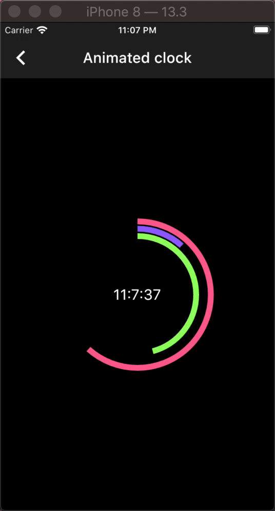
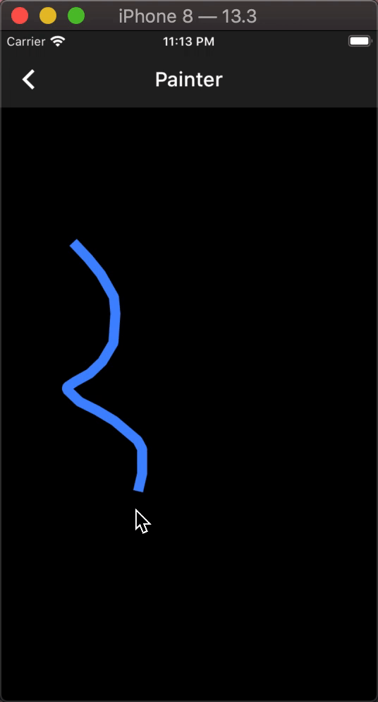

# flutter_p5

Processing API porting for flutter . Heavily dependant on [p5.dart](https://pub.dev/packages/p5) . As of now the project is still under active development . I am open to PRs .

## Example

| Example name   | Code link                                                                          | Preview link                                   |
|----------------|------------------------------------------------------------------------------------|------------------------------------------------|
| Animated clock | [link](https://github.com/pacifio/flutter_p5/blob/master/example/lib/clock.dart)   |    |
| Canvas painter | [link](https://github.com/pacifio/flutter_p5/blob/master/example/lib/painter.dart) |  |
|                |                                                                                    |                                                |