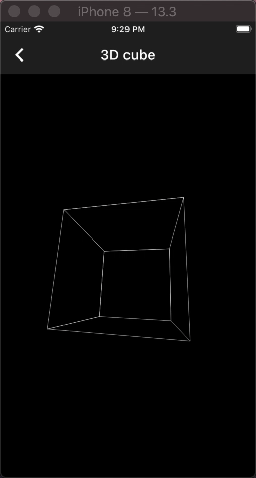

# flutter_p5

Processing API porting for flutter . Heavily dependant on [p5.dart](https://pub.dev/packages/p5) . As of now the project is still under active development . I am open to PRs .

# Install flutter_p5

```yaml
dependencies:
  flutter_p5:
    git:
      url: git://github.com/pacifio/flutter_p5
```

See [examples](https://github.com/pacifio/flutter_p5/blob/master/example/lib/) to see how to use `flutter_p5`

## Example

| Example name   | Code link                                                                          | Preview link                                   |
|----------------|------------------------------------------------------------------------------------|------------------------------------------------|
| Animated clock | [link](https://github.com/pacifio/flutter_p5/blob/master/example/lib/clock.dart)   |    |
| Delaunay experiment | [link](https://github.com/pacifio/flutter_p5/blob/master/example/lib/delaunay_experiment.dart)   |    |
| 3D cube | [link](https://github.com/pacifio/flutter_p5/blob/master/example/lib/3d_cube.dart)   |    |
| Menger Sponge | [link](https://github.com/pacifio/flutter_p5/blob/master/example/lib/menger_sponge.dart)   |    |
| Stars | [link](https://github.com/pacifio/flutter_p5/blob/master/example/lib/stars.dart)   |    |
| Canvas painter | [link](https://github.com/pacifio/flutter_p5/blob/master/example/lib/painter.dart) |  |
|                |                                                                                    |                                                |